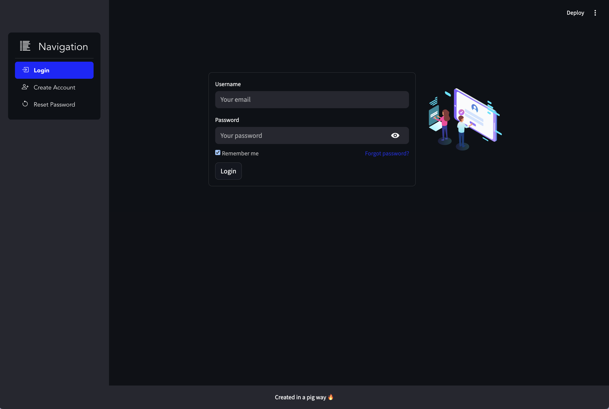

## Login CRUD App (FastAPI + Streamlit)

### Overview
This project provides a simple user management and login flow:
- Backend: FastAPI + SQLAlchemy, password hashing with Argon2, PostgreSQL database.
- Frontend: Streamlit login UI (Courier-based widget) to authenticate users.


The UI:



It includes user registration, login verification, and basic CRUD operations on users.

### Tech Stack
- FastAPI, Uvicorn
- SQLAlchemy
- Argon2 for password hashing
- Pydantic for request/response models
- PostgreSQL (can be adapted)
- Streamlit (frontend)

### Repository Layout
- `backend/`: FastAPI app, database models, routes, and CRUD logic
  - `main.py`: FastAPI application entrypoint
  - `router.py`: API routes (users CRUD, auth)
  - `models.py`: SQLAlchemy models
  - `schemas.py`: Pydantic schemas
  - `crud.py`: Database operations
  - `database.py`: DB connection and session
- `frontend/`: Streamlit app
  - `app.py`: Streamlit entrypoint using a login widget (`src/widgets.py`)
  - `src/widgets.py`, `src/utils.py`: UI and helper functions

### Prerequisites
- Python 3.12
- PostgreSQL running and reachable

### Setup
1) Create and activate a virtual environment (optional if you already have one):
```bash
python3.12 -m venv venv
source venv/bin/activate
```

2) Install dependencies (root or per service):
```bash
pip install -r requirements.txt
```

3) Configure backend environment variables in `backend/.env`:
```bash
DB_USER=your_user
DB_PASSWORD=your_password
DB_HOST=localhost
DB_PORT=5432
DB_NAME=your_database
```

4) Configure frontend environment for Courier in a `.env` (root or `frontend/`):
```bash
COURIER_AUTH_TOKEN=your_courier_token
```

### Run the Backend
From the `backend/` directory:
```bash
cd backend
uvicorn main:app --reload
```
The API will be available at `http://127.0.0.1:8000`.

### Run the Frontend
From the project root or `frontend/` directory:
```bash
streamlit run frontend/app.py
```
The app will prompt for login using the Courier-powered widget.

### API Endpoints (selected)
- `POST /auth/register`: Register a new user. Body: `{ username, email, password, department }`
- `POST /auth/login`: Login with `{ email, password }` (Argon2 verification)
- `GET /users`: List all users
- `GET /users/id/{user_id}`: Get user by id
- `GET /users/email/{user_email}`: Get user by email
- `POST /users`: Create user (server-side hashing is in register flow; direct create assumes full payload)
- `PUT /users/email/{user_email}`: Update user fields; hashes password if present
- `DELETE /users/email/{user_email}`: Delete user by email
- `PUT /users/email/{user_email}/password`: Change password safely (Argon2)

Notes:
- Passwords are hashed with Argon2 (`argon2-cffi`).
- `models.Users` stores `password` (hashed), `department` (enum), and audit fields.

### Environment and Security
- Ensure `backend/.env` is present; the backend will fail fast with a clear error if required variables are missing.
- Do not commit real secrets. Use `.env` files or secret managers for production.

### Development Tips
- If you don’t need a custom port, keep `DB_PORT=5432`.


###Author
Lucas Inocêncio
